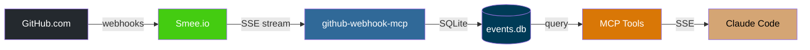
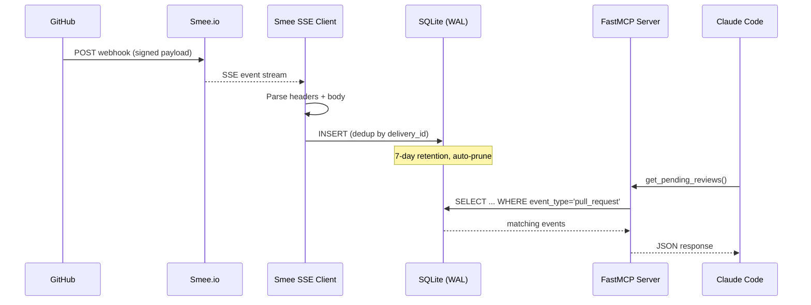

# github-webhook-mcp

[](https://www.python.org/downloads/)
[](LICENSE)
[]()

A local MCP server that gives [Claude Code](https://claude.ai/claude-code) real-time
visibility into GitHub activity across all your repos. No polling. No browser tabs.
Just ask.

## The Problem

You're deep in a Claude Code session. A teammate opens a PR you need to review.
CI fails on your branch. Someone comments on your pull request. You don't know
any of this until you stop working and check GitHub.

The `gh` CLI can query GitHub's API, but it's request-response -- you have to
know to ask. What you want is for Claude to *already know*.

## The Solution

GitHub fires webhooks. [Smee.io](https://smee.io) proxies them to your laptop
(no port forwarding needed). This server catches them, stores them in SQLite,
and serves them as MCP tools that Claude Code can call anytime.



## See It In Action

```
You: "Any PRs I need to review?"

Claude calls get_pending_reviews() →

[
  {
    "repo": "SayMoreAI/saymore",
    "number": 142,
    "title": "feat: add voice activity detection",
    "url": "https://github.com/SayMoreAI/saymore/pull/142",
    "author": "jdoe",
    "requested_at": "2026-03-16T14:22:01Z"
  }
]

Claude: "You have 1 PR to review — #142 on SayMore (voice activity
detection by jdoe, requested 2 hours ago). Want me to review it?"
```

## Quick Start

```bash
# Clone
git clone https://github.com/mikelane/github-webhook-mcp.git ~/dev/github-webhook-mcp
cd ~/dev/github-webhook-mcp

# Run setup (creates Smee channel, configures webhooks, installs services)
./setup.sh

# Register with Claude Code
claude mcp add --transport sse --scope user github-webhooks http://smee.local/sse

# Restart Claude Code, then verify
# In a Claude Code session, the get_notifications() tool should be available
```

### What `setup.sh` does

1. Creates a [Smee.io](https://smee.io) channel (or reuses existing)
2. Generates an HMAC webhook secret
3. Prompts for repos to configure webhooks on
4. Installs Python dependencies via `uv sync`
5. Configures [Caddy](https://caddyserver.com/) reverse proxy (`smee.local` on port 80)
6. Installs macOS LaunchAgents (MCP server + Bonjour mDNS registration)

### Prerequisites

| Tool | Install | Purpose |
|------|---------|---------|
| Python 3.12+ | `brew install python` | Runtime |
| [uv](https://docs.astral.sh/uv/) | `brew install uv` | Package manager |
| [Caddy](https://caddyserver.com/) | `brew install caddy` | Reverse proxy for `.local` domains |
| [gh CLI](https://cli.github.com/) | `brew install gh` | Configures GitHub webhooks |

## MCP Tools

### `get_pending_reviews(repo?)`

PRs where you are a requested reviewer.

```json
[
  {
    "repo": "SayMoreAI/saymore",
    "number": 142,
    "title": "feat: add voice activity detection",
    "url": "https://github.com/SayMoreAI/saymore/pull/142",
    "author": "jdoe",
    "requested_at": "2026-03-16T14:22:01Z"
  }
]
```

### `get_review_feedback(pr_number, repo)`

Review comments and approvals on a specific PR.

```json
[
  {
    "repo": "SayMoreAI/saymore",
    "pr_number": 138,
    "author": "reviewer",
    "state": "changes_requested",
    "body": "The error handling in the WebSocket reconnection needs a backoff strategy.",
    "submitted_at": "2026-03-16T10:15:00Z"
  }
]
```

### `get_ci_status(pr_number?, repo?)`

CI/CD failures — check runs, check suites, workflow runs. Successes are filtered out.

```json
[
  {
    "repo": "mikelane/pytest-gremlins",
    "name": "tests",
    "conclusion": "failure",
    "url": "https://github.com/mikelane/pytest-gremlins/actions/runs/12345",
    "pr_numbers": [42],
    "completed_at": "2026-03-16T09:30:00Z"
  }
]
```

### `get_new_prs(repo?, since?)`

Recently opened pull requests.

```json
[
  {
    "repo": "SayMoreAI/saymore",
    "number": 145,
    "title": "fix: audio buffer overflow on long recordings",
    "url": "https://github.com/SayMoreAI/saymore/pull/145",
    "author": "contributor",
    "opened_at": "2026-03-16T16:00:00Z"
  }
]
```

### `get_notifications(since?)`

Everything. All webhook events since a timestamp, across all repos.

```json
[
  {
    "repo": "SayMoreAI/saymore",
    "event_type": "pull_request",
    "action": "opened",
    "sender": "contributor",
    "received_at": "2026-03-16T16:00:00Z",
    "summary": "contributor opened pull_request on SayMoreAI/saymore"
  }
]
```

**Parameters:**
- `repo` — partial match on `owner/repo` (e.g., `"saymore"` matches `"SayMoreAI/saymore"`)
- `since` — ISO 8601 timestamp; defaults to last 24 hours

## How It Works



**Why Smee.io?** GitHub needs a public URL to send webhooks to. Smee acts as a
cloud relay — GitHub pushes to Smee's URL, your local client pulls via SSE.
No port forwarding, no ngrok, no firewall holes. The channel URL is effectively
a bearer token.

**Why SQLite?** Events survive process restarts. WAL mode allows the Smee
listener to write while MCP tools read concurrently. UNIQUE constraint on
`delivery_id` deduplicates replayed events automatically. Auto-prune keeps
the database from growing unbounded.

**Why SSE transport (not stdio)?** The server runs 24/7 as a LaunchAgent,
collecting events even when Claude Code isn't active. With stdio transport,
events would only be collected while Claude has the process spawned.

## PR Reactor

The server includes an event-driven PR reactor that automatically triggers
code reviews when PRs are opened or updated.

| Event | Behavior |
|-------|----------|
| PR opened | Review triggered immediately |
| Push to existing PR | 15-minute debounce timer starts |
| Another push within 15 minutes | Timer resets |
| 15 minutes of quiet | One review triggered |

Currently configured for `SayMoreAI/saymore`. The reactor spawns
`claude -p "/review-pr <N>"` as a subprocess.

Edit `AUTO_REVIEW_REPO` in `src/github_webhook_mcp/reactor.py` to change
the target repo, or `DEFAULT_DEBOUNCE_SECONDS` to adjust the quiet period.

## Configuration

Settings are read from environment variables via
`~/.config/github-webhook-mcp/.env`:

| Variable | Description | Default |
|----------|-------------|---------|
| `SMEE_CHANNEL_URL` | Smee.io channel URL | *(required)* |
| `GITHUB_WEBHOOK_SECRET` | HMAC-SHA256 secret | *(required)* |
| `GITHUB_USERNAME` | GitHub login for filtering reviews | `mikelane` |
| `MCP_PORT` | Port for the MCP SSE server | `8321` |
| `DB_PATH` | SQLite database location | `~/.local/share/github-webhook-mcp/events.db` |
| `PRUNE_DAYS` | Event retention window | `7` |

## Troubleshooting

### MCP tools not appearing in Claude Code

1. **Check registration:** `claude mcp list` should show `github-webhooks` with type `sse`
2. **Sandbox blocking:** SSE MCP servers need outbound HTTP. If sandbox is enabled,
   disable it in `~/.claude/settings.json` (`"sandbox": {"enabled": false}`)
3. **Server not running:** Check `tail -20 ~/Library/Logs/github-webhook-mcp/stderr.log`
4. **Wrong registration method:** Use `claude mcp add --transport sse`, not manual JSON

### Server logs

```bash
# MCP server + Smee listener
tail -50 ~/Library/Logs/github-webhook-mcp/stderr.log

# Bonjour registration
cat /tmp/smee-bonjour.log
```

### Port 80 conflicts

If `http://smee.local/` doesn't route to the MCP server:

```bash
# Find what's on port 80 — lsof misses root-owned processes!
netstat -anvp tcp | awk '$4 ~ /\.80$/ && $6 == "LISTEN"'

# Common culprit: socat or nginx LaunchDaemon
# Check /Library/LaunchDaemons/ for port 80 forwarders
```

### Verify the full chain

```bash
# 1. Bonjour resolves
dscacheutil -q host -a name smee.local
# Expected: ip_address: 127.0.0.1

# 2. Caddy routes to MCP server
curl -sI http://smee.local/sse
# Expected: content-type: text/event-stream

# 3. Events are being stored
sqlite3 ~/.local/share/github-webhook-mcp/events.db \
  "SELECT COUNT(*) FROM events;"
```

### Restart services

```bash
# MCP server
launchctl unload ~/Library/LaunchAgents/com.mikelane.github-webhook-mcp.plist
launchctl load ~/Library/LaunchAgents/com.mikelane.github-webhook-mcp.plist

# Bonjour
launchctl unload ~/Library/LaunchAgents/com.local.smee-bonjour.plist
launchctl load ~/Library/LaunchAgents/com.local.smee-bonjour.plist

# Caddy
brew services restart caddy
```

## Adding Repos

Re-run `./setup.sh` and enter additional repos, or add manually:

```bash
source ~/.config/github-webhook-mcp/.env

gh api "repos/OWNER/REPO/hooks" \
    -f "config[url]=$SMEE_CHANNEL_URL" \
    -f "config[content_type]=json" \
    -f "config[secret]=$GITHUB_WEBHOOK_SECRET" \
    -F "active=true" \
    -f "events[]=pull_request" \
    -f "events[]=pull_request_review" \
    -f "events[]=pull_request_review_comment" \
    -f "events[]=check_run" \
    -f "events[]=check_suite" \
    -f "events[]=workflow_run" \
    -f "events[]=push" \
    -f "events[]=issues"
```

## Design Decisions

| Decision | Why |
|----------|-----|
| **Smee.io** over ngrok/cloudflare tunnel | Free, no account needed, works behind NAT. Channel URL is the only credential. |
| **SQLite** over in-memory | Survives restarts. WAL mode for concurrent access. Auto-prune prevents unbounded growth. |
| **FastMCP SSE** over stdio | Server runs 24/7 via LaunchAgent. Events accumulate even when Claude isn't active. |
| **Caddy** over nginx | 6-line config vs verbose blocks. Native SSE proxy support. Easy to extend. |
| **Bonjour** over /etc/hosts | Instant mDNS resolution. No `sudo` needed. Matches macOS conventions. |
| **Event-driven reactor** over polling | Smee delivers events in real-time via SSE. Polling the database would add latency and waste cycles. |
| **Signature verification best-effort** | Smee re-serializes JSON, breaking HMAC signatures. The channel URL is the security boundary. |

## Project Structure

```
src/github_webhook_mcp/
    config.py         Settings from env vars (pydantic-settings)
    models.py         WebhookEvent, SmeeEvent (Pydantic)
    signature.py      HMAC-SHA256 verification
    storage.py        SQLite event store (aiosqlite, WAL mode)
    smee_client.py    Smee.io SSE listener
    server.py         FastMCP server with 5 MCP tools
    reactor.py        PR auto-review with debounce
    __main__.py       Entry point: wires everything together
```

## License

[Apache License 2.0](LICENSE)
